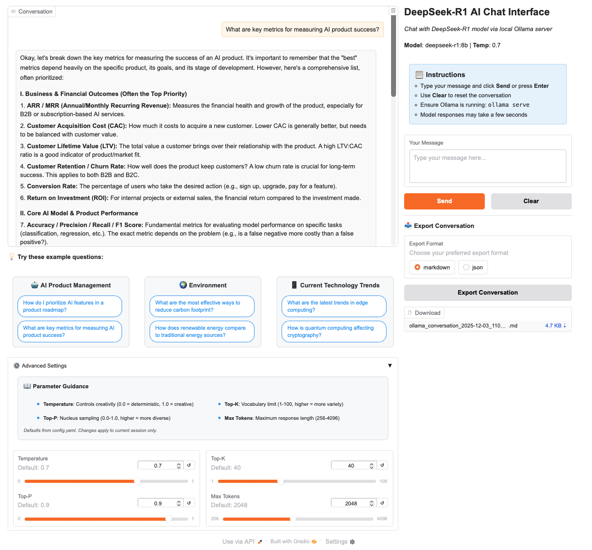

# Ollama Chat Interface

A feature-rich web interface for interacting with AI models via local Ollama server. Built with professional UI/UX design, comprehensive error handling, and advanced conversation management capabilities.



## Overview

This application provides a robust, user-friendly chat interface for communicating with Ollama models (DeepSeek-R1, Llama, Mistral, etc.). Built with production-grade code patterns and modern UI design, it demonstrates best practices for Python AI application development.

### Key Highlights

- **Professional 2-Column UI**: Optimized layout with conversation display and organized control panel
- **Interactive Parameter Controls**: Real-time adjustment of temperature, top-p, top-k, and max tokens
- **Conversation Export**: Export chat history to JSON (with metadata) or Markdown (human-readable)
- **System Prompt Integration**: Configurable AI personality and behavior
- **Response Status Indicators**: Visual progress feedback during generation
- **Example Questions**: Click-to-populate interactive prompts for quick testing
- **Conversation Memory**: Context-aware responses with full history management
- **Production-Ready Architecture**: Comprehensive logging, error handling, and retry logic

## Features

### 🎨 User Interface

- **Professional 2-Column Layout**:
  - Left panel (70%): Spacious conversation window with 630px height
  - Right panel (30%): Organized controls (input, buttons, export)
- **Advanced Settings Accordion**:
  - 2-column parameter layout for better visibility
  - Real-time parameter adjustments (temperature, top-p, top-k, max tokens)
  - Parameters apply per-session without modifying config
- **Example Questions**:
  - 3 topics with 2 questions each (AI Product Management, Environment, Technology Trends)
  - Click-to-populate functionality for instant testing
  - Interactive chips with hover effects
- **Enhanced Typography**:
  - Larger font sizes for better readability (16px base, 14px for sliders)
  - Properly sized value input boxes (48px height with optimized padding)
  - Dark borders and visual polish throughout

### 🚀 Conversation Management

- **System Prompt Support**: Configurable AI personality prepended to all prompts
- **Conversation Memory**: Maintains up to 20 messages (configurable) with full context
- **Parameter Tracking**: Each message stores its generation parameters
- **Timestamp Tracking**: ISO 8601 timestamps for all exchanges
- **Clear Function**: Reset conversation and start fresh

### 📤 Export Capabilities

**JSON Export** (with metadata):
```json
{
  "export_metadata": {
    "timestamp": "2025-12-03T11:07:06",
    "model": "deepseek-r1:8b",
    "system_prompt": "You are a helpful AI assistant...",
    "total_messages": 1,
    "export_version": "1.0"
  },
  "conversation": [...]
}
```

**Markdown Export** (human-readable):
See [example export](screenshots/ollama_conversation_2025-12-03_110706.md) for complete format.

### 🔧 Technical Features

- **Configuration Management**: YAML-based configuration for easy customization
- **Structured Logging**: File and console logging with configurable levels
- **Retry Logic**: Automatic retry with exponential backoff for network resilience
- **Error Handling**: Comprehensive exception handling with user-friendly messages
- **Type Safety**: Full type hints for better IDE support and code quality
- **Modular Architecture**: Reusable common utilities (logging, config, retry, export)
- **Response Status**: Visual progress indicator with descriptive messages

## Requirements

- Python 3.8+
- Ollama running locally (default: http://localhost:11434)
- Any Ollama model installed (default config: `deepseek-r1:8b`)

## Installation

### 1. Clone the Repository

```bash
git clone https://github.com/shrimpy8/ollama-chat-interface.git
cd ollama-chat-interface
```

### 2. Create a Virtual Environment (Recommended)

```bash
python -m venv .venv
source .venv/bin/activate  # On Windows: .venv\Scripts\activate
```

### 3. Install Dependencies

```bash
pip install -r requirements.txt
```

### 4. Set Up Ollama

#### Install Ollama

**Download**: Get Ollama from [https://ollama.com/download](https://ollama.com/download)

- **macOS**: Download and install the .dmg file
- **Linux**: `curl -fsSL https://ollama.com/install.sh | sh`
- **Windows**: Download and run the installer

**Official Documentation**: [https://docs.ollama.com/](https://docs.ollama.com/)

#### Start Ollama and Pull a Model

```bash
# Start Ollama server (in terminal 1)
ollama serve

# Pull the DeepSeek-R1 model (in terminal 2)
ollama pull deepseek-r1:8b

# Or try other popular models:
# ollama pull llama3.2          # Meta's Llama 3.2
# ollama pull mistral           # Mistral AI
# ollama pull qwen2.5           # Alibaba's Qwen

# Verify the model is available
ollama list
```

#### Verify Ollama is Running

```bash
# Test the API
curl http://localhost:11434/api/version

# Expected output: {"version":"0.x.x"}
```

### 5. (Optional) Customize Configuration

The application works out-of-the-box with sensible defaults. To customize settings, edit `config.yaml`:

```yaml
ollama:
  model_name: "deepseek-r1:8b"  # Change to your preferred model
  parameters:
    temperature: 0.7              # Adjust creativity (0.0-1.0)
    top_p: 0.9                    # Nucleus sampling
    top_k: 40                     # Vocabulary limit
    num_predict: 2048             # Max response length
```

## Usage

### Starting the Application

```bash
python app.py
```

The application will start on `http://127.0.0.1:7860` (configurable in `config.yaml`).

### Using the Chat Interface

1. **Open your browser**: Navigate to `http://127.0.0.1:7860`
2. **Try example questions**: Click any of the pre-populated questions
3. **Or type your message**: Enter custom prompts in the input box
4. **Adjust parameters** (optional): Open "Advanced Settings" to fine-tune:
   - **Temperature**: 0.0 (deterministic) to 1.0 (creative)
   - **Top-P**: Nucleus sampling threshold
   - **Top-K**: Vocabulary size limit
   - **Max Tokens**: Response length limit
5. **Send message**: Click "Send" or press Enter
6. **View response**: Watch the status indicator during generation
7. **Export conversation**: Choose JSON or Markdown format and download

### Example Workflows

**Quick Test with Example Questions:**
1. Open the interface
2. Click "How do I prioritize AI features in a product roadmap?"
3. Observe response generation with status indicator
4. Continue conversation with follow-up questions

**Custom Research Session:**
1. Type your research question
2. Adjust temperature to 0.8 for more creative responses
3. Increase max tokens to 4096 for longer answers
4. Export the conversation as Markdown for documentation

**Parameter Experimentation:**
1. Ask the same question with different temperatures
2. Compare response creativity and determinism
3. Export both conversations and analyze differences

## Project Structure

```
ollama-chat-interface/
├── app.py                      # Main application with UI and chat logic
├── config.yaml                 # Centralized configuration
├── common/                     # Shared utilities module
│   ├── __init__.py            # Module exports
│   ├── config_loader.py       # Configuration management
│   ├── logging_config.py      # Structured logging setup
│   ├── retry_utils.py         # Retry decorators and utilities
│   └── export_utils.py        # Conversation export functionality
├── tests/                      # Test suite (63 tests, 76% coverage)
│   ├── test_config_loader.py  # Configuration tests
│   ├── test_retry_utils.py    # Retry logic tests
│   ├── test_logging_config.py # Logging tests
│   └── test_export_utils.py   # Export functionality tests
├── screenshots/                # Documentation screenshots
│   ├── Complete_Chat_Interface.png
│   └── ollama_conversation_*.md
├── requirements.txt            # Python dependencies
├── requirements-dev.txt        # Development dependencies
├── .env.example               # Environment variable template
├── .gitignore                 # Git ignore patterns
├── pytest.ini                 # Pytest configuration
└── README.md                  # This file
```

## Configuration

All settings are managed via `config.yaml` for easy customization without code changes:

```yaml
# Ollama Server Configuration
ollama:
  base_url: "http://localhost:11434"
  api_endpoint: "/api/generate"
  model_name: "deepseek-r1:8b"

  # Model Parameters (overridable via UI)
  parameters:
    temperature: 0.7        # Creativity level (0.0 = deterministic, 1.0 = creative)
    top_p: 0.9             # Nucleus sampling
    top_k: 40              # Top-k sampling
    num_predict: 2048      # Maximum tokens to generate

# Request Configuration
request:
  timeout: 120             # Timeout in seconds for API requests
  retry:
    max_attempts: 3        # Maximum retry attempts for failed requests
    min_wait: 2            # Minimum wait time between retries (seconds)
    max_wait: 10           # Maximum wait time between retries (seconds)
    multiplier: 2          # Exponential backoff multiplier

# Logging Configuration
logging:
  level: "INFO"            # Logging level: DEBUG, INFO, WARNING, ERROR, CRITICAL
  format: "%(asctime)s - %(name)s - %(levelname)s - %(message)s"
  file: "ollama_chat.log"  # Log file name
  console: true            # Enable console logging
  file_logging: true       # Enable file logging

# Gradio UI Configuration
ui:
  title: "DeepSeek-R1 AI Chat Interface"
  description: "Chat with DeepSeek-R1 model via local Ollama server"
  theme: "default"         # Gradio theme: default, soft, monochrome
  share: false             # Enable public sharing via gradio.live link
  server:
    port: 7860             # Port to run the server on
    host: "127.0.0.1"      # Host address (127.0.0.1 for local only)

# Conversation Settings
conversation:
  system_prompt: "You are a helpful AI assistant powered by DeepSeek-R1."
  memory_enabled: true     # Enable conversation memory
  context_window: 4096     # Maximum context window in tokens
  history:
    max_messages: 20       # Maximum number of messages to keep in history
    show_timestamps: true  # Show timestamps in chat history
```

**Customize settings** by editing `config.yaml` - no code changes needed!

## Testing

The project includes a comprehensive test suite with **63 tests** covering core functionality, achieving **76% code coverage**.

### Running Tests

```bash
# Install development dependencies
pip install -r requirements-dev.txt

# Run all tests
pytest

# Run with verbose output
pytest -v

# Run with coverage report
pytest --cov=. --cov-report=html --cov-report=term

# Run specific test file
pytest tests/test_export_utils.py

# Run tests by marker
pytest -m unit              # Unit tests only
pytest -m integration       # Integration tests only
```

### Test Coverage

**Configuration Management (26 tests)**:
- YAML configuration loading and validation
- Default value handling
- Error handling for missing/invalid files
- All configuration getter methods
- Singleton pattern implementation

**Retry Logic (15 tests)**:
- Retry decorator creation and configuration
- Exponential backoff timing
- Connection error handling
- HTTP error handling (404, 500)
- Timeout and request exception handling
- Safe API call wrapper with fallback values

**Logging (14 tests)**:
- Logger setup and configuration
- Console and file handlers
- Log level configuration
- Log message formatting
- File creation and writing
- Error handling for invalid paths

**Export Utilities (8 tests)**:
- JSON export with metadata
- Markdown export formatting
- Empty conversation handling
- Unicode support (Chinese, Arabic, emoji)
- Parameter preservation
- Structure validation

Coverage reports: `htmlcov/index.html` (detailed interactive report)

## Advanced Features

### System Prompt Integration

The system prompt is automatically prepended to all prompts, defining the AI's personality and behavior:

```python
# Configured in config.yaml
conversation:
  system_prompt: "You are a helpful AI assistant powered by DeepSeek-R1."

# Automatically included in every API call
# User sees normal conversation, but model receives context
```

### Interactive Parameter Controls

Adjust model behavior in real-time via the Advanced Settings accordion:

| Parameter | Range | Description | Impact |
|-----------|-------|-------------|--------|
| Temperature | 0.0-1.0 | Creativity level | 0.0 = deterministic, 1.0 = creative |
| Top-P | 0.0-1.0 | Nucleus sampling | Higher = more diverse vocabulary |
| Top-K | 1-100 | Vocabulary limit | Higher = more variety in responses |
| Max Tokens | 256-4096 | Response length | Higher = longer responses |

**Note**: UI parameters override config defaults for the current session only. Changes are not persisted.

### Response Status Indicators

Visual feedback during response generation:
1. 🤔 **Thinking...** - Processing user input
2. ⏳ **Generating response...** - Model is generating
3. ✅ **Complete!** - Response delivered

### Conversation Export

Export your conversations with full metadata:

**JSON Format Features**:
- Complete metadata (timestamp, model, system prompt, version)
- All conversation exchanges with parameters
- Structured for programmatic access
- Unicode support (Chinese, Arabic, emoji)

**Markdown Format Features**:
- Human-readable format for documentation
- Includes metadata header
- System prompt display
- Timestamped exchanges
- Parameter annotations for each message

**File Naming**: `ollama_conversation_YYYY-MM-DD_HHMMSS.{json|md}`

### Retry Logic

Network requests automatically retry on failure with exponential backoff:

- **Attempt 1**: Immediate
- **Attempt 2**: Wait 2 seconds
- **Attempt 3**: Wait 4 seconds
- **Maximum wait**: 10 seconds
- **Handles**: Connection errors, timeouts, HTTP errors, request exceptions

### Error Handling

Comprehensive error handling for all scenarios:

| Error Type | User Message | Recovery Action |
|-----------|--------------|-----------------|
| Connection Error | "Cannot connect to Ollama server" | Check if Ollama is running |
| Timeout | "Request timed out after 120 seconds" | Try shorter prompt or increase timeout |
| Model Not Found | "404 Client Error: model not found" | Check model name in config.yaml |
| Empty Response | "Received empty response" | Retry request |
| Unexpected Error | "An unexpected error occurred" | Check logs for details |

## Troubleshooting

### Common Issues

**Application Won't Start**
- Verify all dependencies installed: `pip install -r requirements.txt`
- Check Python version: `python --version` (3.8+ required)
- Ensure config.yaml exists and is valid YAML

**Cannot Connect to Ollama**
```bash
# Check if Ollama is running
ps aux | grep ollama

# Start Ollama if not running
ollama serve

# Verify API is accessible
curl http://localhost:11434/api/version
```

**Model Not Found (404 Error)**
```bash
# List available models
ollama list

# Pull the required model (match config.yaml model_name)
ollama pull deepseek-r1:8b
```

**Slow Responses**
- DeepSeek-R1 is a reasoning model and may take longer
- Check your system resources (CPU/RAM usage)
- Try a smaller model: `ollama pull llama3.2` (faster)
- Reduce `num_predict` in config.yaml or via UI

**Values Cut Off in Slider Inputs**
- This issue has been resolved with optimized padding (1px top, 22px-23px bottom)
- If still experiencing issues, check your browser zoom level (should be 100%)

**Port Already in Use**
```bash
# Change port in config.yaml
ui:
  server:
    port: 8080  # Use different port
```

### Debugging

All operations are logged to `ollama_chat.log`. For detailed debugging:

1. **Enable debug logging**:
   ```yaml
   # config.yaml
   logging:
     level: "DEBUG"
   ```

2. **Check the log file**:
   ```bash
   tail -f ollama_chat.log
   ```

3. **Test API directly**:
   ```bash
   curl -X POST http://localhost:11434/api/generate \
     -H "Content-Type: application/json" \
     -d '{"model":"deepseek-r1:8b","prompt":"Hello","stream":false}'
   ```

## Performance Considerations

- **Conversation Memory**: Automatically trims to `max_messages` to stay within token limits
- **Request Timeout**: Default 120 seconds (configurable)
- **Retry Logic**: Maximum 3 attempts with exponential backoff
- **Token Usage**: Monitor `num_predict` to control response length and cost
- **Model Selection**: Smaller models (7B-8B) respond faster than larger models (70B+)
- **UI Responsiveness**: Status indicators provide real-time feedback during generation

## Security Notes

- **Local Deployment**: Runs on 127.0.0.1 by default (localhost only)
- **No API Keys**: Uses local Ollama - no external API credentials needed
- **Public Sharing**: Disabled by default (`share: false` in config.yaml)
- **Input Validation**: All user inputs validated before processing
- **Error Sanitization**: Error messages sanitized to avoid information leakage
- **No Data Collection**: All conversations stay local

## Customization

### Changing the Model

Edit `config.yaml`:

```yaml
ollama:
  model_name: "llama3.2"  # Change to your preferred model
```

Ensure the model is installed:

```bash
ollama pull llama3.2
```

### Popular Model Options

| Model | Size | Best For | Speed |
|-------|------|----------|-------|
| deepseek-r1:8b | 8B | Reasoning, analysis | Medium |
| llama3.2 | 3B-70B | General chat, versatile | Fast-Slow |
| mistral | 7B | Efficient, balanced | Fast |
| qwen2.5 | 7B-72B | Multilingual, coding | Fast-Medium |
| gemma2 | 2B-27B | Lightweight, efficient | Very Fast |

### Customizing the UI

```yaml
ui:
  title: "My Custom AI Chat"
  description: "Powered by Ollama and Python"
  theme: "soft"              # Options: default, soft, monochrome
  share: true                # Enable public sharing (use with caution)
  server:
    port: 8080               # Custom port
```

### Adjusting System Prompt

```yaml
conversation:
  system_prompt: "You are an expert Python developer and educator. Provide clear, detailed explanations with code examples."
```

### Disabling Conversation Memory

For stateless interactions:

```yaml
conversation:
  memory_enabled: false
```

## Development

### Project Philosophy

This project demonstrates production-ready Python development:

- **Configuration over code**: Settings externalized to YAML
- **Observability**: Comprehensive logging for debugging
- **Resilience**: Retry logic for network failures
- **Modularity**: Reusable utilities for common operations
- **Type safety**: Full type hints for better IDE support
- **User Experience**: Professional UI with real-time feedback
- **Documentation**: Clear docstrings and comprehensive README

### Code Quality Standards

- Type hints on all functions and methods
- Google-style docstrings
- Specific exception handling (no bare `except`)
- Structured logging throughout
- Configuration-driven behavior
- No hardcoded values
- 76% test coverage

### Extending the Application

The modular architecture makes it easy to extend:

**Adding a new feature**:
1. Add configuration to `config.yaml`
2. Update `ConfigLoader` with getter methods
3. Implement feature in `app.py`
4. Add logging and error handling
5. Write tests in `tests/`
6. Update README documentation

**Creating custom utilities**:
1. Add new module to `common/`
2. Export in `common/__init__.py`
3. Import in `app.py` as needed
4. Write comprehensive tests

## License

[MIT License](LICENSE)

## Acknowledgments

This application utilizes the following technologies:

- [Ollama](https://ollama.com/) - Local LLM runtime and API
- [Gradio](https://www.gradio.app/) - Web UI framework
- [DeepSeek-R1](https://ollama.com/library/deepseek-r1) - Reasoning-focused language model
- [Tenacity](https://tenacity.readthedocs.io/) - Retry library with exponential backoff
- [PyYAML](https://pyyaml.org/) - YAML configuration parser
- [Pytest](https://pytest.org/) - Testing framework

## Additional Resources

- [Ollama Official Documentation](https://docs.ollama.com/)
- [Ollama Model Library](https://ollama.com/library)
- [Gradio Documentation](https://www.gradio.app/docs)
- [DeepSeek-R1 Model Card](https://ollama.com/library/deepseek-r1)
- [Python Type Hints Guide](https://docs.python.org/3/library/typing.html)

---

**Made with ❤️ using Ollama, Gradio, and Python**

*For issues, feature requests, or contributions, visit the [GitHub repository](https://github.com/shrimpy8/ollama-chat-interface)*
